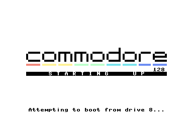
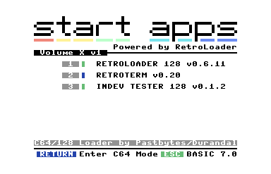
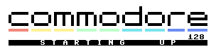

<div align = center>

# Start Apps
### VERSION 0.7

Jorge Castillo & Pablo Roldán


---
</div>

## Introduction

*Start Apps* is a 32K cartridge for Commodore 128 that can contain a set of programs for C64 and C128 modes. The core of the project is an application launcher, to which executable programs in PRG format must be added to obtain the cartridge binary. It is designed to activate when starting the Commodore 128, displaying a startup logo, and then a menu that allows you to launch applications, enter BASIC 7.0 or go to C64 mode. It can be overridden by booting the system with the SHIFT key pressed.

## Release history

### v0 (23-Sep-2021):
- First 16K version, formerly known as RetroApps.

### v0.1 (30-Sep-2021):
- First 32K version.

### v0.2 (06-Oct-2021):
- Separate internal and external versions.
- Added 80-column support.

### v0.3 (29-May-2022):
- Added some macros.
- Menu and loader reworked.

### v0.4 (29-Jun-2022):
- Changes to cartridge initialization.
- Startup logo and menu title are now separate PETSCII files.
- BASIC 7.0 screen now supports 80-column mode.
- Some minor changes to C64 and C128 mode loaders.

### v0.5 (15-Sep-2023):
- More macros were added to make the code more readable.

### v0.6 (25-Feb-2024):
- Now the same binary works as an internal or external cartridge.
- Added support for upper-graphics PETSCII logo.

### v0.7 (16-Mar-2024):
- Minor changes were made to facilitate cartridge customization.

## Requirements
- A Commodore 128 or an emulator with Function ROM support, such as VICE.
- The ACME cross-assembler to generate the cartridge binary.
- A 27C256 EPROM to be written with the binary obtained.
- If installing as an external cartridge, a 32K C128 cartridge board is required. This is not necessary if it is installed as an internal cartridge.

## Installation

Start Apps can work both internally as a ROM installed in the U36 socket, and externally, in the form of a C128 cartridge.

To install it as an internal cartridge, you simply have to write the EPROM with the binary obtained when compiling, and then place it in socket U36 on the C128 board.

To install it as an external cartridge, you will need a 32K C128 cartridge board, and place the EPROM recorded with the binary obtained when compiling there.

Keep in mind that an external C128 cartridge, although using the same connector, can have twice the capacity of a standard C64 cartridge (16 or 32K versus 8 or 16K in the C64). A C64 cartridge is activated by the GAME and EXROM signals, while a C128 cartridge is detected by the system at boot time, with the help of the MMU.

On the Commodore 128, a C64 cartridge will always have boot priority, followed by an external C128 cartridge, and finally an internal C128 cartridge. In this way, it would be possible to have two different versions of Start Apps, one internal and one external, always starting the external one first.

## Usage
Start Apps starts by displaying a startup logo, then attempts to boot from disk 8 (usually the CP/M operating system).



If there is no bootable disk, it shows the menu.



In the menu you can launch an application using the numbers on the main keyboard or the numeric keypad.

Programs with a blue rectangle are Commodore 64 executables, while those with a green rectangle are Commodore 128 executables.

You can enter C64 mode by pressing RETURN, and C128 mode by pressing ESC.

Booting the Commodore 128 with the SHIFT key pressed will override the cartridge and boot BASIC 7.0 normally.

## Customizing and building Start Apps

Start Apps can be customized in 3 ways:

- Startup logo
- Menu title
- Menu entries

### Startup logo:


The startup logo is a PETSCII file named **startlogo.seq**, which can be replaced by another created by the user.

### Menu title:


The menu title is another PETSCII file named **starttitle.seq**, and can also be replaced by the user.

### Menu entries:

You can customize the list of programs shown in the menu directly in the source code, by modifying the **startappsx.asm** file with a text editor.

```
;///////////////////////////////////////////////////////////////////////////////////
; RetroLoader 128 (C128 mode)

PRG1
	!binary "retroloader128.prg"
PRG1End
PRG1Txt
	!text "retroloader 128 V0.6.11"
	!byte 0

;///////////////////////////////////////////////////////////////////////////////////
; Retroterm (C64 mode)

PRG2
	!binary "retroterm.prg"
PRG2End
PRG2Txt
	!text "retroterm V0.20"
	!byte 0

;///////////////////////////////////////////////////////////////////////////////////
; InDev Tester 128 (C128 mode)

PRG3
	!binary "indev128.prg"
PRG3End
PRG3Txt
	!text "indev tester 128 V0.1.2"
	!byte 0
```

In the example project we have 3 programs, but the menu can have a maximum of 7.
For each menu entry we have to provide the following information:

- Name of the PRG file to load
- Name to display in the menu
- Execution mode (C64 or C128)

The name of the PRG file must be with its corresponding path, if it is not in the same directory as the source code.

The name displayed in the menu must be a null-terminated string, and is printed with inverted case.

```
MenuEntries:				; Number of programs on the menu
	!byte 3
PRGMode:					; 0 = C64 mode		255 = C128 mode
	!byte 255,0,255,0,0,0,0
CARTEND:

	!align $ffff,0
```
The execution mode of each program must be modified in PRGMode, where there are 7 bytes, one for each possible program. The first program in the menu is a C128 executable, the same as the third, therefore those bytes have the value 255, while the second program is a C64 executable, so the second byte is 0.

Finally, the number of menu entries must be specified in MenuEntries.

### Building
Once the corresponding changes have been made, the binary can be generated with the command:

`
acme startappsx.asm
`

The resulting binary will be a file named **startappsx.bin**
